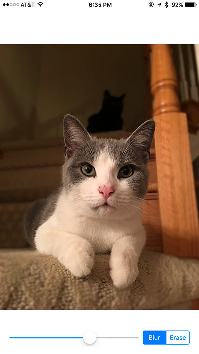

# MWXDefocus

A view for defocusing an image by drawing a blur.



### Usage:
```Objective-C
#import <MWXDefocus/MWXDefocus.h>

MWXDefocusView *defocusView = [[MWXDefocusView alloc] init];
[self addSubview:defocusView];
defocusView.mode = MWXDrawingModeDraw;
defocusView.blurRadius = 12.0;
defocusView.brushSize = 50.0;
[defocusView setImage:[UIImage imageNamed:@"cat"]];
```

